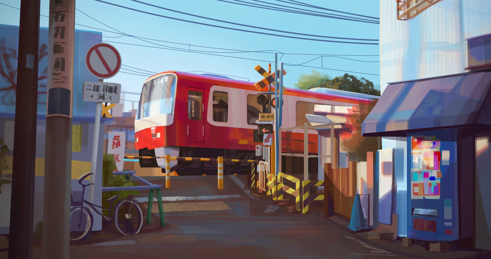

<h1 align="center">
  🏳️‍⚧️ xqtc | Tila 🏳️‍⚧️
</h1>

<h2 align="center">
  

    
  

</h2>

  

---

Hi I'm Tila - aka xqtc - a full-time GNU/Linux user and weeb. I'm still attending High-School and teaching myself programming in Rust. I also like self-hosting services like my own E-Mail server, Plex Media Server and an Discord Bot.

  

---

<h3>
  
    
    
  

</h3>

[twitter]: https://twitter.com/_xqtc
[instagram]: https://instagram.com/l4in_iw4kura
